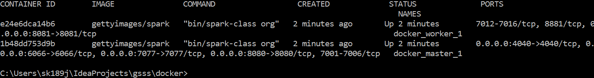
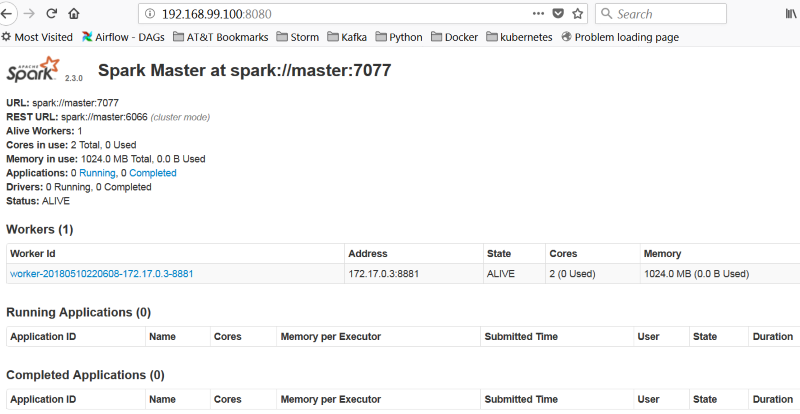
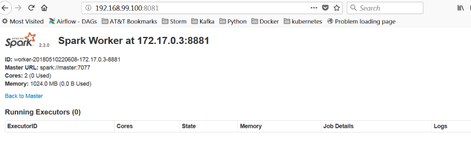
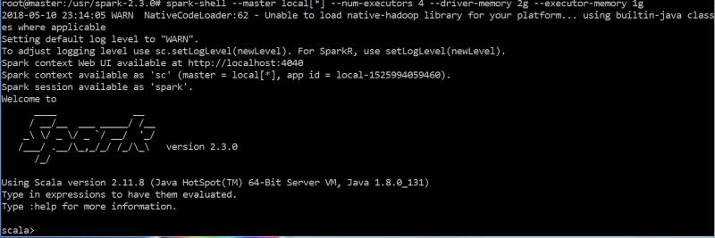

# Getting Started with Spark using Scala

## Installation
1. Download and install [git](https://git-scm.com/downloads).
2. Clone gsss project from Git [repository](https://github.com/skomarovsky/gsss)
3. Download or upgrade Java JDK to latest [version](http://www.oracle.com/technetwork/java/javase/downloads/index.html) of SE Developer Kit.
4. Download or upgrade sbt to latest [version](https://www.scala-sbt.org/1.x/docs/Installing-sbt-on-Windows.html).
5. Download and install Docker community edition for [Windows](https://store.docker.com/editions/community/docker-ce-desktop-windows). You must use the version of Docker which is supported by Windows version installed on your computer. 

## Changing resources for docker virtual machine
1. Start Virtual Box Manager and choose `Machine`->`Settings`->`System`->`Matherboard` and change **Base Memory** to 8GB.
2. Swich to `Processor` tab and set **Processor(s)** to 4.
    
## Starting Spark Standalone cluster
1. Find and start **Docker Quickstart terminal**. It will start Docker Virtual Box machine.
2. From Windows command prompt change folder to the *gsss/docker* folder.
3. Type `docker-compose up`. You can monitor startup process in **Docker Quickstart terminal**

## Stopping Spark Standalone cluster
2. From Windows command prompt change folder to the *gsss/docker* folder.
3. Type `docker-compose down`. You can monitor shutdown process in **Docker Quickstart terminal**

## Connecting to the cluster
1. Open new windows command prompt.
2. Check if cluster up and running:  
`docker ps` 

If you can find both docker_master_1 and docker_worker_1 instances than your Spark cluster up and running.
3. To execute interactive shell inside of master container type  
`docker exec -i -t docker_master_1 /bin/bash`
4. To execute interactive shell inside of worker container type  
   `docker exec -i -t docker_worker_1 /bin/bash`
5. It is possible to execute multiple interactive shells for same conatiner   

## Accessing Master and Worker UI
1. First of all you need to find address of your virtual machine which you use to start docker for Windows:  
`docker-machine ip default`  
Replace default with name you actually use. To find run  
`docker-machine ls`
2. If you use Windows 10 and later you can install Docker without installation of Virtual Box,
therefore docker-machine command will not be available. Please check appropriate documentation how to find addresses to access containers.
3. Start you favorite browser and navigate to the Master UI at http://<VM IP>:8080 

or Worker UI at http://<VM IP>:8081 

## Starting spark-shell session
Now we ready to start spark-shell using the following commands:  
**Note. You start spark-shell from inside master container.**  
`spark-shell --master local[*] --num-executors 4 --driver-memory 2g --executor-memory 1g`  

## Starting jupyter

Enter code below in the first jupyter cell  
    var counter = 0  
    val data = Array(1, 2, 3, 4, 5)  
    val rdd = sc.parallelize(data)  
    rdd.foreach(x => counter += x)  
    println("Counter value: " + counter)
 

## Downloading Data

http://archive.ics.uci.edu/ml/index.php
